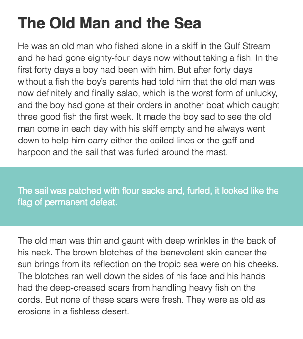

Every site needs a conainer of some sort. Here's a way to leverage CSS Grid to make pulling content in and out of your page's container a breeze. We'll be working toward replicating this example:



We've got a column of text, centered on the page, and a highlighted section with a full-width background and text that horizontally aligns with its other siblings.

## The Container

To create a centered column for our content, we’ll need three columns in our parent grid. But before that, we need to invoke the dark, mystical power of CSS grid. Follow the spell closely: `display: grid;`

Got it? Great. Magic isn’t so hard after all.

## The FR Unit

Next we need to understand another magical piece of CSS: the `fr` (fractional) unit. This unit’s value is the relationship between its fr value compared to all the children of its parent.

> Example:  
> If we have a containing parent element that is 300px wide, a single child with a width of 1fr would also be 300px wide. Two children with a width of 1fr would be 150px each. One child with 1fr and a second child with 2fr would be 100px and 200px, respectively.

## Minmax

The final building block we’ll use is `minmax()`. The function takes 2 parameters and works exactly like it sounds. Using `minmax(10px, 100px)` on a column would make it at least `10px` wide, but no more than `100px` wide.

We won't dive into it in this article, but combining `minmax()` with CSS Custom Properties is insanely satisfying.

## Building the Columns

Use `grid-template-columns` explicitly assign columns to a grid element. To get a responsive layout, we'll put `minmax()` to work.

```scss
.container {
  grid-template-columns:
    minmax(1em, 1fr)
    minmax(0, 30em)
    minmax(1em, 1fr);
}
```

The code above creates three columns. The first and third are flexible between `1em` and `1fr`. The center column will be between 0 and 30em wide. In this case, if the viewport width is over 32em (1em + 30em + 1em). The first and third columns will take up an equal amount of the remaining space, creating a centered container.

Why not `max-width: 30em;` and `margin: 0 auto;` you might ask? Just hang on.

## Naming Columns

We have 3 columns, and 4 column lines we can align content to. To contain an element inside the center column, we would add `grid-column: 2 / 3;` to a child of `.container`.

To simplify this, we can names to grid lines using the following syntax: `[linename-start]` and `[linename-end]`. Adding line names to our template results in:

```scss
.container {
  grid-template-columns:
    [viewport-start] minmax(1em, 1fr)
    [container-start] minmax(0, 30em) [container-end]
    minmax(1em, 1fr) [viewport-end];
}
```

## Obedient Children

Now we can take our container's children and tell them where to live. And what to do. And when to go to bed.

```scss
.item--full {
  grid-column: viewport;
}
.item--contained {
  grid-column: container;
}
```

As you can probably guess, `.item--full` will span the width of all three columns, and `.item--contained` will span only the center column.

## Inheritance

The final trick to our layout is aligning the content inside an element with the `.item--full` class. We’ll need to pass down the parent grid to the `.item--full` child.

```scss
.item--full {
  grid-column: viewport;
  display: inherit;
  grid-template-columns: inherit;

  > * {
    grid-column: container;
  }
}
```

Now, the `.item--full` class is a grid container of its own. Since it spans the full width of the parent grid, the resulting nested grid is essentially a carbon copy laid on top of its parent, with the addition of declaring `grid-column: container;` on every direct descendent.

Take a look at the [final result](https://codepen.io/igloude/pen/pPVPxP). Happy Gridding!
